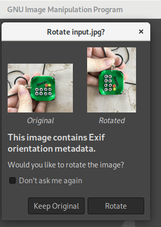

# jimp-exif-text
Demonstrate a bug with EXIF rotated images

# Steps to reproduce
1. checkout this repo
2. `yarn`
3. `yarn start`
4. `output.jpg` should get created in the same directory

# Original image

This image is in a protrait orientation (height > width). Note that your browser/github might still show it as landscape here! Download the file and open it in Photoshop or a similar program. Here is how GIMP tells me that there is EXIF rotation data here:

# Output that is broken

This is the output.jpg that JIMP produces. There are black bars on the right and left, and the image is actually in landscape this time.
