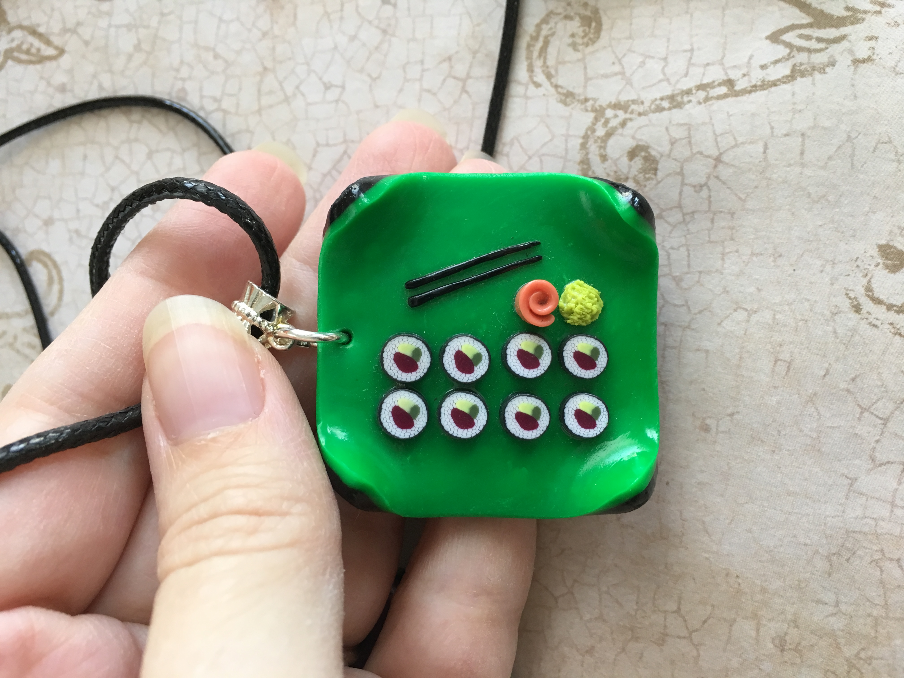
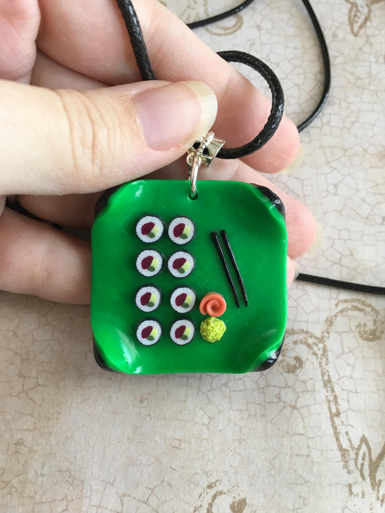

# jimp-exif-text
Demonstrate a bug with EXIF rotated images

# steps to reproduce
1. checkout this repo
2. `yarn`
3. `yarn start`

# this image should be in a protrait orientation (height > width)

# this is the output.jpg that JIMP produces
